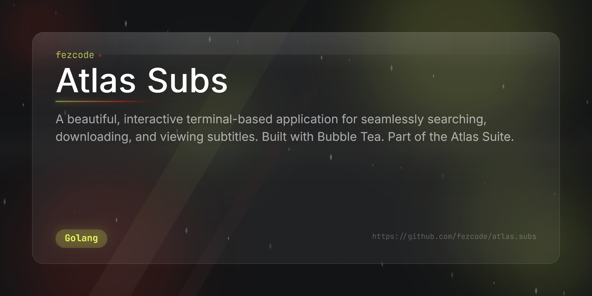

# Atlas Subs



**atlas.subs** is a beautiful, interactive TUI application for searching and downloading subtitles. Part of the **Atlas Suite**.


## ✨ Features

- 🔍 **Interactive Search:** Easily search for movie and series subtitles using a Bubble Tea TUI.
- 📜 **Extensive Results:** Powered by OpenSubtitles API to provide accurate subtitle options.
- 📥 **Auto Download:** Downloads and extracts `.gz` subtitle files automatically.
- ⌨️ **Vim Bindings:** Navigate using `j`/`k` or arrow keys.
- 📦 **Cross-Platform:** Binaries available for Windows, Linux, and macOS.

## 🚀 Installation

### From Source
```bash
git clone https://github.com/fezcode/atlas.subs
cd atlas.subs
gobake build
```

## ⌨️ Usage

Run the binary to enter the TUI:
```bash
./atlas.subs
```

### Command-line Flags
```
atlas.subs              Start the interactive TUI
atlas.subs -v           Show version
atlas.subs -h           Show help
```

## 📄 License
MIT License - see [LICENSE](LICENSE) for details.
